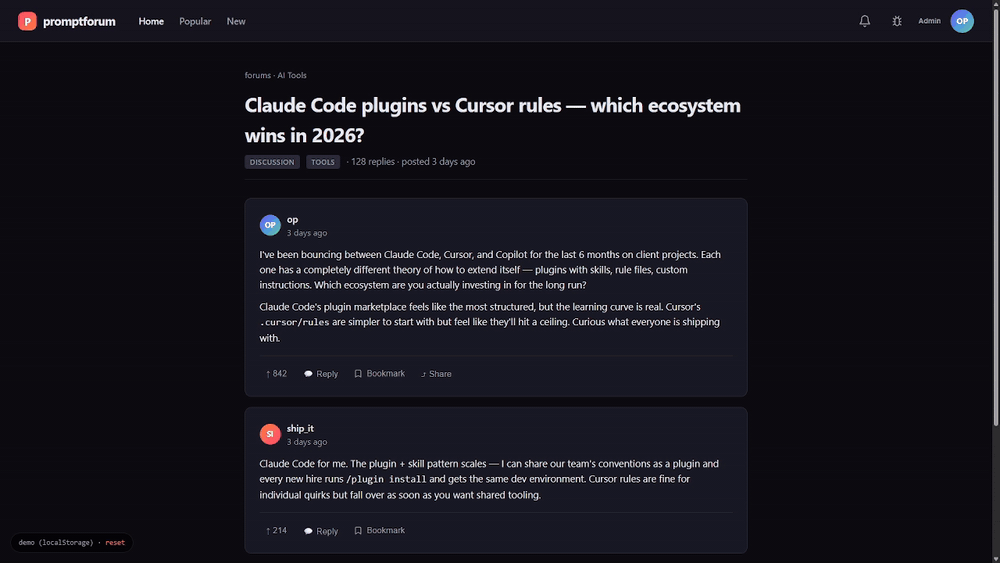

<div align="center">


# bugkit

**Users click. AI fixes. Done.**

*AI-friendly bug reports for any project. Users report bugs with full context (URL, element selector, stack trace, viewport, voice transcription). Admins hit one button. Paste into Claude Code — or any AI coding agent — and the fix ships. Reporter gets notified. Loop closes in minutes, not days.*



<br><br>

[](https://github.com/bglglzd/bugkit)
[](./SPEC.md)
[](./LICENSE)

</div>

---

## Who this is for

bugkit works the same way in two very different settings:

**🛠  Building for a boss, client, or team lead**
You're the dev. Someone non-technical is telling you what to change — and vague words lose a lot in translation. Send them the staging link. They click the bug icon, pick the exact thing that looks wrong, **speak or type** what they want. You paste the output into Claude Code / Cursor / Copilot. The fix ships the same day, exactly how they described it. No more "did they mean the header or the hero?"

**🚀  Running a product with real users**
You have a live app. Bugs and feature requests come in every day. Users click the bug icon from inside the product — you get a queue of reports with full context already captured. Paste → AI fixes → user gets notified their report was resolved. Your product improves as fast as you can read reports.

**Same spec. Same plugin. Same install command. Vibe-coder-friendly.**

---

## Install — pick your AI agent

| Your AI agent | Paste this into the chat |
|---|---|
| **Claude Code** | <pre>/plugin marketplace add bglglzd/bugkit<br>/plugin install bugkit@bglglzd-bugkit<br>/bugkit:install</pre> |
| **Cursor** | <pre>Install bugkit in this project from<br>https://raw.githubusercontent.com/bglglzd/bugkit/main/INSTALL.md</pre> |
| **GitHub Copilot Chat** | <pre>Install bugkit in this project from<br>https://raw.githubusercontent.com/bglglzd/bugkit/main/INSTALL.md</pre> |
| **ChatGPT / Codex** (with repo access) | <pre>Install bugkit in this project from<br>https://raw.githubusercontent.com/bglglzd/bugkit/main/INSTALL.md</pre> |
| **Gemini CLI / Aider / Cline / anything else** | Paste the contents of [INSTALL.md](./INSTALL.md) |

Claude is going to:
1. Detect your stack (web app / API / CLI / static site / mobile / bot / etc.)
2. Ask **one** question: where should bug reports go? (DB / GitHub Issues / Telegram / JSONL / email / Slack / Discord / combination)
3. Implement the matching recipe from [`recipes/`](./recipes/)
4. Offer optional **voice transcription** (🎤 mic next to the description field — Web Speech API default, local Whisper upgrade, never paid APIs)
5. Verify with a test report

Takes about 5–10 minutes for a full web app install.

---

## How it works

```
User finds bug
  ↓  clicks bug icon, optionally picks the broken element, speaks or types
Bug report saved with full context (URL, selector, stack trace, viewport, voice transcript)
  ↓
Admin opens report → clicks "Copy Context for AI"
  ↓  standardized prompt with everything the AI needs
Paste into Claude Code / Cursor / Copilot / ChatGPT
  ↓
AI fixes the bug, ships a commit
  ↓
Admin marks report "resolved" with a short note + commit SHA
  ↓
Reporter gets notified
```

No translation step. No "can you repro?" back-and-forth. The context that a human would gather manually is captured at the moment the bug happens.

---

## Why this beats a random feedback form

| Traditional feedback form | bugkit |
|---|---|
| "Something is broken" | Selector, XPath, HTML, viewport, URL, stack trace, voice transcript |
| Admin reads, asks clarifying questions | Admin pastes to AI, AI already has everything |
| Fix takes days | Fix ships in minutes |
| Form and format differ per project | Standardized spec — same ritual across all your projects |
| No closed-loop status | Reporter notified at each state change |
| Typing long descriptions is a chore | 🎤 press-to-speak, auto-transcribed |

---

## Voice transcription (optional)

🎤 Mic button next to the description field. Press, speak, transcript streams into the textarea live, edit if you want, submit.

- **Default:** Web Speech API (browser-native). Zero install, zero keys, zero server. Chrome / Edge / Safari.
- **Upgrade:** local Whisper (whisper.cpp) via a thin proxy route. ~150MB one-time model download, fully offline, works in every browser including Firefox.
- **Never:** paid APIs as the default path. OpenAI / Groq / Deepgram are a footnote for people who want them.

Voice is always optional — typing still works.

---

## Documentation

- **[SPEC.md](./SPEC.md)** — data schema + AI context format (the portable standard, unchanged in v1.0)
- **[INSTALL.md](./INSTALL.md)** — universal paste-in prompt for any AI agent
- **[recipes/](./recipes/)** — pre-tuned adapters per sink (DB, GH Issues, Telegram, JSONL, email, Slack, Discord, CLI)
- **[examples/](./examples/)** — what the AI context output actually looks like
- **[Landing page](https://bglglzd.github.io/bugkit)** — one-page version with agent-picker tabs and copy buttons

---

## License

MIT — use it anywhere, no attribution required (but stars are appreciated).

---

<details>
<summary>📘 Deploying the landing page</summary>

The landing page lives in `docs/`. To enable it on GitHub Pages:

1. Go to your repo's **Settings → Pages**.
2. Under **Source**, pick **Deploy from a branch**.
3. Branch: `main`, folder: `/docs`.
4. Save. After ~1 minute, the page is live at `https://<your-username>.github.io/bugkit/`.

`.nojekyll` is already in place so your HTML ships as-is.

</details>

---

<sub>Want new bugkit releases in your inbox? **Star** or **Watch** this repo on GitHub — you'll be notified automatically.</sub>
